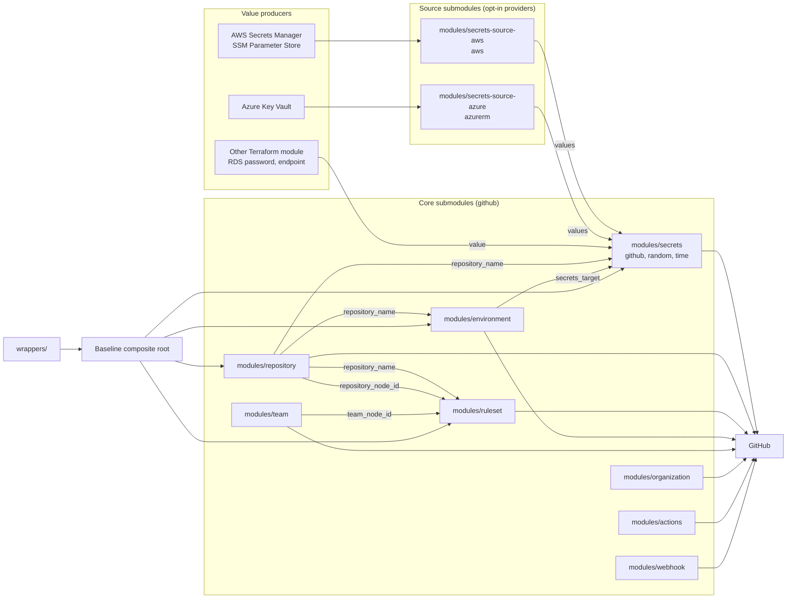

# Architecture

## One repository, one tag, ten submodules

Everything in this project ships from a single git repository under a single
version tag: ten submodules under `modules/` plus a baseline composite root at
the repository root.

The alternative, one repository per module, is the older CloudDrove shape and
it was rejected here for two reasons.

1. **The modules are coupled by data, not just by topic.** The environment
   submodule emits `secrets_target` in exactly the shape the secrets submodule
   expects in `targets.environments`. The repository submodule emits
   `repository_node_id` in exactly the shape the ruleset submodule expects for
   a bypass actor. Splitting the repositories would turn every one of those
   contracts into a cross-repository version constraint that has to be
   resolved by hand on each upgrade.
2. **One tag makes the compatible set obvious.** A consumer pinning
   `version = "0.0.2"` gets a set of submodules that were tested together.
   There is no matrix of which repository version works with which.

The cost of the single repository is that a change anywhere bumps the version
everywhere. That is acceptable for a module suite this size, and it is the
same trade the Terraform Registry itself assumes with the `//modules/<name>`
subdirectory convention.

Every submodule is independently consumable:

```hcl
module "secrets" {
  source  = "clouddrove/github-modules/github//modules/secrets"
  version = "0.0.2"
}
```

Every submodule is also gated by the same `enabled` flag and carries the same
five standard variables (`enabled`, `name`, `environment`, `managedby`,
`label_order`), so a caller can turn any part of a composition off without
restructuring it.

## The secrets capability is split three ways

The secrets capability is not one module. It is three:

| Submodule | Providers it requires |
| --- | --- |
| `modules/secrets` | `github`, `random`, `time` |
| `modules/secrets-source-aws` | `aws` |
| `modules/secrets-source-azure` | `azurerm` |

The split is by provider dependency, and the reason is that `aws` and
`azurerm` have to stay opt-in. The common case for this suite is a caller
pushing a literal string, most often an output of some other module in the
same run. That caller must not have to configure an AWS provider, hold AWS
credentials, or download the AWS plugin in order to write one GitHub secret.

The obvious-looking alternative does not work. Folding the AWS data sources
into `modules/secrets` behind a `count = 0` or an empty `for_each` still
forces every caller to configure the provider, because **Terraform configures
a provider whenever the graph contains resource nodes belonging to it,
including nodes gated to zero instances**. Instance count is decided after
provider configuration, not before it, so `count = 0` avoids creating
infrastructure but does not avoid the provider. A module that mentions an
`aws` resource anywhere in its configuration is an `aws` module for every one
of its callers. The only way to make the dependency genuinely optional is to
put it in a submodule the caller chooses not to instantiate.

The two source submodules are read-only by construction. They contain data
sources and nothing else, so no misconfiguration of them can write to AWS or
Azure. Their provider floors are deliberately conservative, `aws >= 5.0` and
`azurerm >= 4.0`, and are not raised to the current major. Raising a floor on
a data-source-only module would force a provider upgrade on every consumer for
no functional gain.

Both source submodules emit a `values` output of type
`map(object({ value = string }))`. That is deliberately the same shape as an
entry in the `secrets` input of `modules/secrets`, so composition is a plain
`merge()` with no transformation step:

```hcl
module "github_secrets" {
  source = "../../modules/secrets"

  secrets = merge(
    module.aws_source.values,
    module.azure_source.values,
    { RDS_PASSWORD = { value = module.rds.master_password } },
  )

  targets = { repositories = ["api"] }
}
```

## Data flow

A credential travels from wherever it is produced to wherever a workflow reads
it:

```
producer module or vault
  -> optional source submodule (secrets-source-aws / secrets-source-azure)
    -> modules/secrets
      -> GitHub
```

At the GitHub end there are two independent axes.

- **Scope**: repository, organization, or environment.
- **Kind**: `actions`, `dependabot`, or `codespaces`.

The two combine, with one gap that comes from the GitHub API rather than from
this module: there is no environment scope for Dependabot or Codespaces
secrets.

| Kind | Repository | Organization | Environment |
| --- | :---: | :---: | :---: |
| `actions` | yes | yes | yes |
| `dependabot` | yes | yes | no |
| `codespaces` | yes | yes | no |
| Actions variables | yes | yes | yes |

The source submodule step is optional. A caller who already holds the value in
Terraform, as an output of an RDS module or a Key Vault module in the same
run, passes it straight into `secrets` and never instantiates a source
submodule at all.

## Module dependency diagram



The baseline root composes four submodules: `repository`, `ruleset`,
`environment`, and `secrets`. That is the set with real ordering between them,
and the root exists to encode that ordering once. `team`, `organization`,
`actions`, and `webhook` are not composed by the root because they have no
data dependency on a repository being created first; they are called directly.

`wrappers/` is one level above the root: it takes a map of items and calls the
baseline root once per entry, resolving each value in the order entry, then
`defaults`, then a literal fallback.

## Sensitive values and `for_each`

The whole point of this suite is wiring credentials produced elsewhere into
GitHub, and those credentials arrive marked sensitive. A source submodule's
`values` output marks the *entire map* sensitive, not just its elements, and
an RDS master password does the same to any map it is merged into.

Terraform rejects a `for_each` derived from a sensitive value. So there is a
hard rule in `modules/secrets`:

> **Never derive a `for_each` from `var.secrets`.**

Every resource in that module iterates secret *names* through `nonsensitive()`
and looks the value up inside the resource body:

```hcl
resource "github_actions_secret" "this" {
  for_each = nonsensitive(toset(keys(local.actions_repo)))

  repository  = local.actions_repo[each.value].repository
  secret_name = local.actions_repo[each.value].name
  value       = sensitive(local.value_for[local.actions_repo[each.value].name])
}
```

Names are not secret. They appear in plan output and in the GitHub UI
regardless, so the `secret_names` and `variable_names` outputs also unwrap them
with `nonsensitive()` rather than forcing every consumer to do it.

This is enforced, not just documented. `tests/fixtures/sensitive_source`
builds the exact composition that breaks a naive implementation, a sensitive
`values` map merged with a generated entry, and `tests/sensitive_source.tftest.hcl`
plans it. Any rewrite that iterates `var.secrets` directly fails that test.

## Secret values in state

Every secret this suite publishes is recorded in Terraform state in clear
text. This is a property of Terraform and the GitHub provider, not something
the modules choose.

In provider 6.13.0 the argument carrying the value is `value` on the five
Actions and Dependabot secret resources, where `plaintext_value` and
`encrypted_value` are both deprecated, and it is still `plaintext_value` on
the two Codespaces resources. The name of the argument changes nothing about
the exposure: Terraform records the argument either way. Marking a value
sensitive hides it from CLI output; it does not encrypt or omit it in the
state file.

The consequence for consumers is a hard requirement, spelled out in
`modules/secrets/README.md` and in `examples/secrets-sync/README.md`: remote
state encrypted with a customer-managed key, restricted read access,
versioning, and access logging. For cloud provider access specifically, OIDC
federation through `modules/actions` is the stronger alternative, because a
short lived token exchanged at run time is never stored anywhere at all.

## Naming

There is no dependency on a `labels` module. GitHub resources carry no tags,
so there is nothing for one to produce. Each submodule composes its own name
in `locals.tf` from `label_order`:

```hcl
locals {
  id = join("-", compact([
    for part in var.label_order :
    lookup({ name = var.name, environment = var.environment }, part, "")
  ]))
}
```

With the default `label_order` of `["name", "environment"]`, `name = "api"`
and `environment = "prod"` compose to `api-prod`.

## Testing

Every submodule has a `tests/` directory using native `terraform test` with
`mock_provider` blocks, plus `tests/` at the repository root for the composite
and the sensitive-map regression. No test requires a real GitHub token, AWS
account, or Azure subscription. `make test` runs the root suite and then every
submodule suite.
